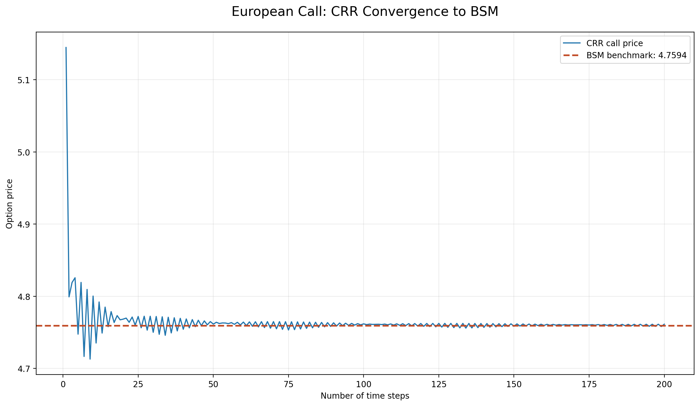
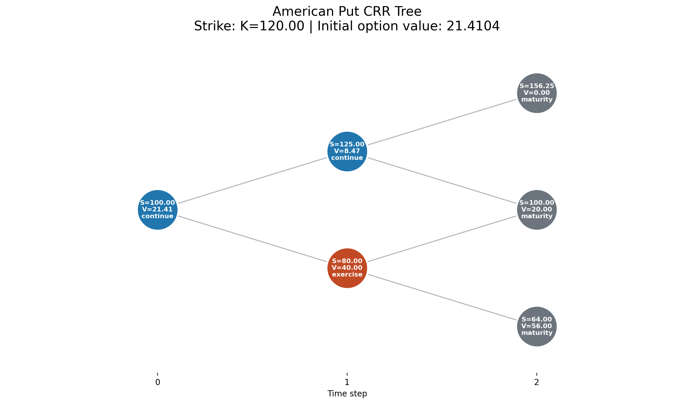

# Binomial Option Pricing

## Status

Status: **validated pricing module**.

The Cox-Ross-Rubinstein implementation prices European calls, European puts
and American puts. It also records the American early-exercise policy on
small trees and generates reproducible pricing figures.

The binomial implementation is covered by 29 unit tests. Together with the
14 Black-Scholes-Merton tests, the current pricing suite contains 43 passing
tests.

Related files:

- [`../../src/derivatives/binomial.py`](../../src/derivatives/binomial.py)
- [`../../src/derivatives/binomial_plots.py`](../../src/derivatives/binomial_plots.py)
- [`../../tests/test_binomial.py`](../../tests/test_binomial.py)
- [Vanilla option pricing](vanilla_option_pricing.md)

## Research question

How can a recombining discrete-time market reproduce no-arbitrage option
pricing, converge toward the European Black-Scholes-Merton benchmark and
represent the path-dependent early-exercise decision of an American put?

I use the tree in two ways: a memory-efficient version computes the time-zero
price, while a small diagnostic version lets me inspect continuation,
exercise and stopping decisions node by node.

## Scope

The current implementation:

- uses the Cox-Ross-Rubinstein (CRR) parameterisation;
- prices European calls and puts by backward induction;
- supports a continuous dividend yield, with `q = 0` by default;
- prices American puts by comparing continuation and immediate exercise;
- exposes full-tree diagnostics for small pedagogical examples;
- compares European CRR prices with Black-Scholes-Merton prices.

Greeks, implied volatility and Monte Carlo pricing remain outside this
module's current scope. A general American call interface, large-tree exercise
boundary extraction and finite-difference pricing are planned separately;
they are not hidden features of the current implementation.

The implemented public interface is:

```python
crr_european_call(S, K, T, sigma, r, n_steps, q=0)
crr_european_put(S, K, T, sigma, r, n_steps, q=0)
crr_american_put(S, K, T, sigma, r, n_steps, q=0)
build_crr_american_put_tree(S, K, T, sigma, r, n_steps, q=0)
```

## Conventions

| Symbol | Meaning |
| --- | --- |
| `S` | Current spot price of the underlying asset |
| `K` | Strike price |
| `T` | Time to maturity, expressed in years |
| `sigma` | Annualised volatility of the underlying asset |
| `r` | Annual continuously compounded risk-free rate |
| `q` | Annual continuous dividend yield |
| `N` | Number of time steps in the tree |
| `delta_t` | Length of one time step, equal to `T / N` |
| `u` | Multiplicative up factor |
| `d` | Multiplicative down factor |
| `p` | Risk-neutral probability of an up move |
| `D` | One-step discount factor |

The model requires consistent units: if `T` is expressed in years, `sigma`,
`r` and `q` must all be annualised.

## One-period binomial model

Over one time step, the spot price can move to either:

$$
S_u = S_0u
$$

or:

$$
S_d = S_0d
$$

With continuous compounding and dividend yield `q`, the no-arbitrage
condition is:

$$
d < e^{(r-q)\Delta t} < u
$$

For `q = 0`, this is the continuous-compounding counterpart of the discrete
condition $d < 1+r < u$.

## Cox-Ross-Rubinstein parameters

For `N` equal time steps:

$$
\Delta t = \frac{T}{N}
$$

CRR represents the volatility shock through log-symmetric movements:

$$
u = e^{\sigma\sqrt{\Delta t}}
$$

$$
d = e^{-\sigma\sqrt{\Delta t}} = \frac{1}{u}
$$

The risk-neutral probability is chosen so that the expected one-step growth
of the underlying equals its risk-neutral carry:

$$
p = \frac{e^{(r-q)\Delta t}-d}{u-d}
$$

The one-step discount factor is:

$$
D = e^{-r\Delta t}
$$

The condition $0 < p < 1$ is equivalent to the no-arbitrage condition above.
The value of `p` is a pricing probability, not a forecast of the real-world
probability that the asset price will rise.

## Risk-neutral martingale condition

The definition of `p` gives the one-step conditional expectation:

$$
\mathbb{E}^{\mathbb{Q}}[S_{i+1}\mid\mathcal{F}_i]
= S_i\left[(1-p)d+pu\right]
= S_i e^{(r-q)\Delta t}
$$

Therefore the dividend-adjusted discounted process

$$
M_i=e^{-(r-q)t_i}S_i
$$

is a martingale under the risk-neutral measure:

$$
\mathbb{E}^{\mathbb{Q}}[M_{i+1}\mid\mathcal{F}_i]=M_i
$$

When `q = 0`, this reduces to the usual discounted stock-price martingale.
With a non-zero dividend yield, the adjustment accounts for the cash flows
distributed by the underlying. A dedicated unit test checks this invariant.

## European option pricing

At maturity, a node containing `j` up moves and `N-j` down moves has spot
price:

$$
S_{N,j} = S_0u^jd^{N-j}
$$

The terminal call and put payoffs are:

$$
C_{N,j} = \max(S_{N,j}-K,0)
$$

$$
P_{N,j} = \max(K-S_{N,j},0)
$$

## Backward induction

Starting from the terminal payoffs, each earlier option value is the
discounted risk-neutral expectation of its two successor values:

$$
V_{i,j}
=
D\left[pV_{i+1,j+1}+(1-p)V_{i+1,j}\right]
$$

Repeating this calculation from `i = N-1` down to `i = 0` produces the
time-zero option value $V_{0,0}$.

## Boundary cases

At maturity, the option value equals its intrinsic value:

$$
C_0 = \max(S-K,0),
\qquad
P_0 = \max(K-S,0)
\quad\text{when }T=0
$$

When `sigma = 0`, the risk-neutral terminal price is deterministic and the
European values are:

$$
C_0 = \max\left(Se^{-qT}-Ke^{-rT},0\right)
$$

$$
P_0 = \max\left(Ke^{-rT}-Se^{-qT},0\right)
$$

The implementation rejects non-positive `S` or `K`, negative `T` or
`sigma`, non-positive or non-integer `n_steps`, and CRR parameters that do
not produce a risk-neutral probability strictly between zero and one.

## American put and early exercise

For an American put, each node compares immediate exercise with continuation:

$$
P_{i,j}^{A}
=
\max\left(
K-S_{i,j},
D\left[pP_{i+1,j+1}^{A}+(1-p)P_{i+1,j}^{A}\right]
\right)
$$

The nodes at which intrinsic value exceeds continuation value define the
discrete early-exercise policy.

The implementation records `exercise`, `continue` or `maturity` at every
diagnostic node. Ties are assigned to continuation because exercise is
selected only when intrinsic value is strictly greater than continuation
value.

For a realised path, the optimal stopping time is the first exercise node,
or maturity if no earlier exercise occurs:

$$
\tau^*
=
\inf\left\{t_i:E_{i,j}>H_{i,j}\right\}\wedge T
$$

where $E_{i,j}=\max(K-S_{i,j},0)$ is immediate exercise value and
$H_{i,j}$ is continuation value. Consequently, $\tau^*$ is path-dependent,
not one deterministic date shared by all scenarios. In the two-period test
tree below, the all-down path stops at `t = 1`, while the all-up path reaches
maturity at `t = 2`.

## Numerical complexity

Pricing from a one-dimensional vector of terminal payoffs requires
$O(N^2)$ time and $O(N)$ memory. The regular pricing functions use this
memory-efficient representation. Full diagnostics require $O(N^2)$ memory
and are therefore intended for small pedagogical trees rather than large
production calculations.

## How I validated it

The 29 binomial tests cover:

- manually priced one-period European calls and puts;
- European put-call parity;
- the boundary cases `T = 0` and `sigma = 0`;
- explicit input and no-arbitrage validation;
- convergence of European CRR prices toward Black-Scholes-Merton prices;
- the inequality between American and European put values;
- an American put with a non-zero dividend yield;
- early exercise at an internal node;
- the recorded early-exercise policy and path-dependent stopping time;
- the risk-neutral martingale condition.

The full project suite is executed from the repository root with:

```bash
python3 -m unittest discover -s tests
```

Validated on 2026-08-07: 43 tests pass, including 29 binomial tests.

## European convergence result

The convergence experiment uses `S = 42`, `K = 40`, `T = 0.5`,
`sigma = 0.20`, `r = 0.10` and `q = 0`.

| Method | Steps | Call price |
| --- | ---: | ---: |
| Black-Scholes-Merton | Closed form | 4.759422 |
| CRR | 200 | 4.761357 |
| Absolute CRR error | 200 | 0.001935 |

Convergence is visible but not monotonic. The terminal lattice alternately
aligns more or less closely with the strike as `N` changes, producing an
even/odd oscillation whose amplitude decreases as the time step becomes
smaller.



## American early-exercise result

The diagnostic tree uses `S = 100`, `K = 120`, `T = 2`,
`sigma = ln(1.25)`, `r = ln(1.05)`, `q = 0` and two time steps. Its initial
American put value is `21.410375`.

The root continues. After one down move, immediate exercise is optimal;
after one up move, continuation remains preferable. This small example
makes the comparison between intrinsic and continuation value directly
inspectable.



## Reproducible figures

Both public figures and their numerical summaries are regenerated from the
project root with:

```bash
python3 -m scripts.generate_pricing_figures
```

The script writes the PNG files under `reports/pricing/figures/` and prints
the American put price, the BSM benchmark, the final CRR estimate and its
absolute error.

An exercise-boundary plot for a large tree remains a possible extension,
not a requirement for the current pricing milestone.

## Interpretation

The European convergence result links the discrete model to the continuous
Black-Scholes-Merton benchmark without implying monotonic convergence at
every step count. The American diagnostic makes a different point: the price
alone is not enough, because the value comes from choosing between exercise
and continuation at every reachable node.

I kept the diagnostic tree to two periods so that every spot, option value and
decision can be checked by hand. Large trees are useful for numerical
approximation; small trees are better for explaining the mechanism and testing
its invariants.

## Model limitations

The CRR tree is a discrete approximation based on constant volatility,
interest rate and dividend yield. It excludes transaction costs, bid-ask
spreads, liquidity constraints, jumps and stochastic volatility. A large
number of time steps improves the approximation but increases computation
time. The model does not calibrate `sigma` from option-market data and does
not claim that a theoretical price equals an executable quote.

Full-tree diagnostics consume quadratic memory and are deliberately rejected
for degenerate `T = 0` or `sigma = 0` cases, where no meaningful branching
tree exists. The regular pricing functions still handle those limits
analytically.

## Current conclusion and next step

The CRR European and American-put pricers are complete for the scope described
here: the manual examples, no-arbitrage conditions, BSM convergence and
exercise policy are all covered by tests. I may add a large-tree exercise
boundary or an American call later if they answer a specific question, but
neither is needed before the next task: Greeks and finite-difference
validation.

## References

- John C. Hull, *Options, Futures, and Other Derivatives*, Chapter 13.
- Steven E. Shreve, *Stochastic Calculus for Finance I*, discrete-time
  no-arbitrage and risk-neutral pricing.
- Cox, Ross and Rubinstein (1979), "Option Pricing: A Simplified Approach."
