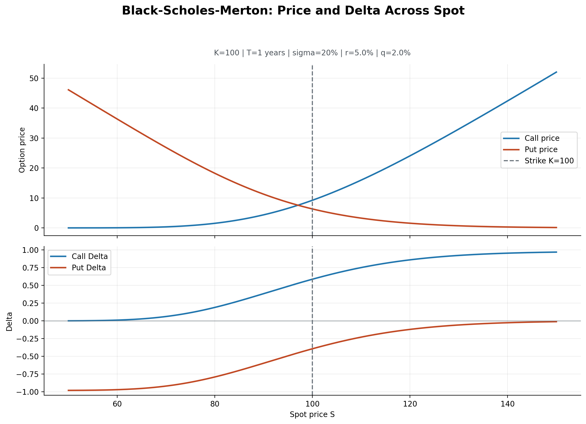
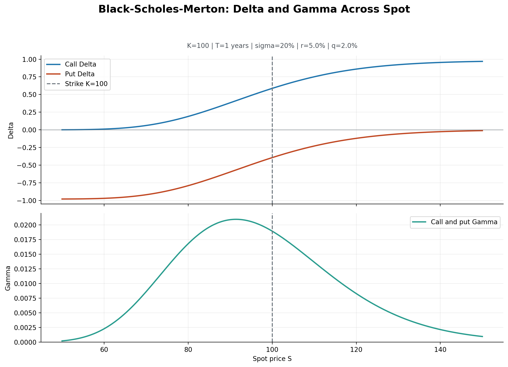
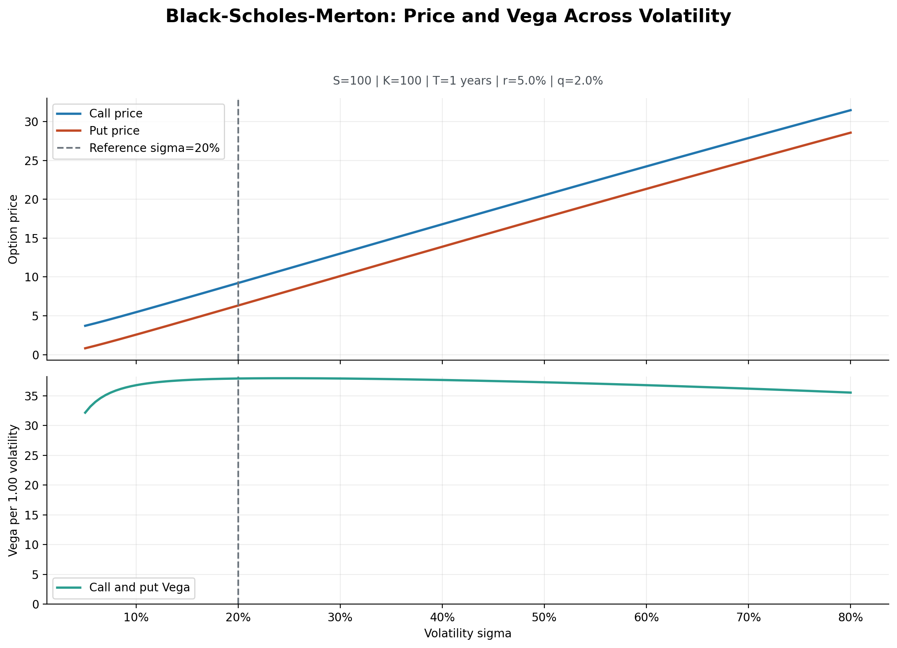
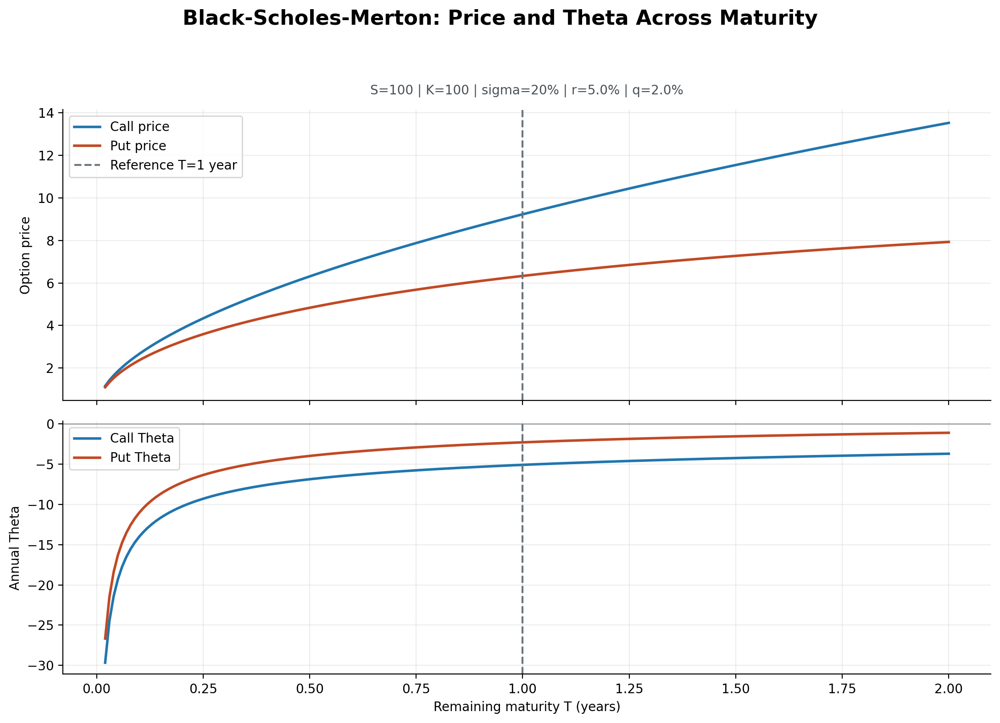
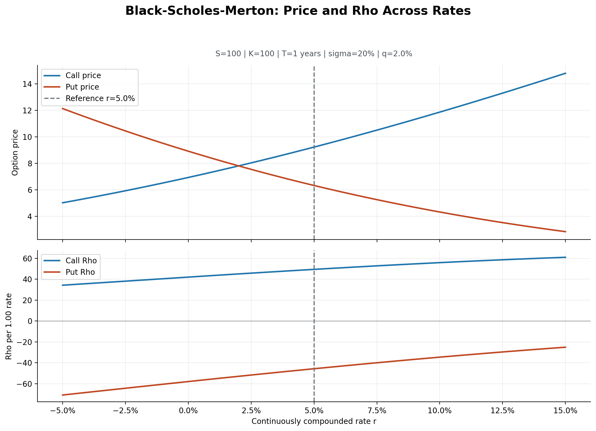

# Black-Scholes-Merton Greeks

## Status

Status: **validated sensitivity module**.

The module implements the analytical Black-Scholes-Merton Delta, Gamma, Vega,
Theta and Rho for European calls and puts with a continuous dividend yield.
The formulas are checked against reference values, central finite differences
and identities derived from put-call parity.

The implementation is covered by 25 dedicated unit tests. Together with the
vanilla and binomial pricing tests, the current derivatives suite contains 68
passing tests.

Related material:

- [vanilla option pricing](vanilla_option_pricing.md);
- [Black-Scholes-Merton pricer](../../src/derivatives/black_scholes.py);
- [Greeks implementation](../../src/derivatives/greeks.py);
- [Greeks plotting functions](../../src/derivatives/greeks_plots.py);
- [Greeks tests](../../tests/test_greeks.py);
- [reproducible figure generator](../../scripts/generate_greeks_figures.py).

## Objective

The Greeks measure how the value of an option reacts to small changes in its
market and model inputs. The objective is to derive the analytical
Black-Scholes-Merton Greeks for European calls and puts, interpret their
financial meaning and validate them independently with finite differences.

The Greeks are local sensitivities. They describe the slope or curvature of
the pricing function at one set of inputs; they do not give an exact repricing
for a large market move.

## Scope

The current module covers:

- European calls and puts;
- a continuous dividend yield `q`;
- Delta, Gamma, Vega, Theta and Rho;
- analytical formulas derived from the Black-Scholes-Merton price;
- central finite-difference checks using the existing pricing functions;
- consistency checks derived from put-call parity.

The following subjects remain outside this first module:

- American-option Greeks;
- a PDE pricer based on finite differences;
- volatility smiles, stochastic volatility and discrete dividends.

## Parameter conventions

| Variable | Convention |
| --- | --- |
| $S$ | Current underlying price, strictly positive |
| $K$ | Strike price, strictly positive |
| $T$ | Remaining time to maturity in years, strictly positive for the analytical Greeks |
| $\sigma$ | Annualised BSM volatility parameter in decimal form, strictly positive; when calibrated to a market option price, it is implied volatility |
| $r$ | Continuously compounded risk-free rate in decimal form |
| $q$ | Continuous dividend yield in decimal form |
| Theta ($\Theta$) | Annual change caused by the passage of calendar time |
| Vega ($\mathcal{V}$) | Sensitivity to a change of `1.00` in volatility |
| Rho ($\rho$) | Sensitivity to a change of `1.00` in the interest rate |

The core functions return mathematical sensitivities per unit of input.
Market display conventions can then be obtained with:

$$
\mathcal{V}_{\text{per volatility point}}=\frac{\mathcal{V}}{100}
$$

$$
\rho_{\text{per percentage point}}=\frac{\rho}{100}
$$

Similarly, an annual Theta may be converted to a daily value, but the chosen
day-count convention must be explicit. Dividing by `365` gives a
calendar-day approximation; dividing by `252` gives a trading-day
approximation. The pricing functions themselves return annual Theta.

## Normal-distribution notation

The formulas use:

- $N(x)$, the standard normal cumulative distribution function;
- $\phi(x)$, the standard normal probability density function.

$$
\phi(x)=\frac{1}{\sqrt{2\pi}}e^{-x^2/2}
$$

The usual Black-Scholes-Merton terms are:

$$
d_1=
\frac{\ln(S/K)+(r-q+\frac{1}{2}\sigma^2)T}
{\sigma\sqrt{T}}
$$

$$
d_2=d_1-\sigma\sqrt{T}
$$

The reference prices are:

$$
C=Se^{-qT}N(d_1)-Ke^{-rT}N(d_2)
$$

$$
P=Ke^{-rT}N(-d_2)-Se^{-qT}N(-d_1)
$$

## Definitions and financial interpretation

Let $V$ denote the option value and let $t$ denote calendar time. Since $T$
is the remaining time to maturity, increasing $t$ reduces $T$.

| Greek | Mathematical definition | Main question |
| --- | --- | --- |
| Delta | $\Delta=\partial V/\partial S$ | How does the option react to a small move in the underlying? |
| Gamma | $\Gamma=\partial^2 V/\partial S^2$ | How quickly does Delta change when the underlying moves? |
| Vega | $\mathcal{V}=\partial V/\partial \sigma$ | How does the option react to a small change in the BSM volatility input? |
| Theta | $\Theta=\partial V/\partial t=-\partial V/\partial T$ | How does the option react to the passage of time? |
| Rho | $\rho=\partial V/\partial r$ | How does the option react to a small change in the risk-free rate? |

Let $\delta x$ denote a small finite change in an input $x$. Retaining the
first-order effect of every input and the second-order spot effect gives the
Delta-Gamma approximation. Written first with partial derivatives:

$$
\delta V
\approx
\frac{\partial V}{\partial S}\,\delta S
+\frac{1}{2}\frac{\partial^2 V}{\partial S^2}(\delta S)^2
+\frac{\partial V}{\partial \sigma}\,\delta\sigma
+\frac{\partial V}{\partial t}\,\delta t
+\frac{\partial V}{\partial r}\,\delta r
$$

Using the Greek symbols defined above, the same approximation is:

$$
\delta V
\approx
\Delta\,\delta S
+\frac{1}{2}\Gamma(\delta S)^2
+\mathcal{V}\,\delta\sigma
+\Theta\,\delta t
+\rho\,\delta r
$$

The lowercase $\delta$ distinguishes a small change from the Greek Delta
$\Delta$. It is preferable to $d$ here because the Gamma term is a
second-order correction, whereas a first total differential contains only
first-order terms. This truncated approximation ignores other second-order
terms, higher-order terms and interactions between inputs. It becomes less
reliable as the changes become larger.

## Analytical formulas

All formulas below describe a long option position. A short position has the
opposite sensitivity.

### Delta

For a European call:

$$
\Delta_C=e^{-qT}N(d_1)
$$

For a European put:

$$
\Delta_P=e^{-qT}\left(N(d_1)-1\right)
=-e^{-qT}N(-d_1)
$$

Delta is the first-order exposure to the underlying. With no dividends, call
Delta lies between `0` and `1`, while put Delta lies between `-1` and `0`.
With a continuous dividend yield, these bounds are scaled by $e^{-qT}$.

The call-put Delta relationship is:

$$
\Delta_C-\Delta_P=e^{-qT}
$$

### Gamma

Call and put Gamma are identical:

$$
\Gamma_C=\Gamma_P=
\frac{e^{-qT}\phi(d_1)}{S\sigma\sqrt{T}}
$$

Gamma measures convexity with respect to the underlying price. It is positive
for a long vanilla call or put and is usually largest near the strike. A high
Gamma means that Delta can change rapidly, which matters for discrete
hedging.

### Vega

Call and put Vega are identical:

$$
\mathcal{V}_C=\mathcal{V}_P=
Se^{-qT}\phi(d_1)\sqrt{T}
$$

Vega is positive for long European calls and puts under the model: greater
volatility increases the value of their convex payoff. The raw formula gives
the price change for a `1.00` change in volatility. A one-percentage-point
change, such as `20%` to `21%`, corresponds to `0.01` and therefore uses
Vega divided by `100`.

The formula differentiates with respect to the BSM parameter `sigma`; it does
not determine how that parameter was obtained. If `sigma` is calibrated from
an observed option price, Vega is the sensitivity to implied volatility. If
an assumed or historical estimate is used instead, Vega is the sensitivity
to that chosen model input.

### Theta

The report defines Theta as the change caused by the passage of calendar
time:

$$
\Theta=\frac{\partial V}{\partial t}
=-\frac{\partial V}{\partial T}
$$

For a European call:

$$
\Theta_C=
-\frac{Se^{-qT}\phi(d_1)\sigma}{2\sqrt{T}}
+qSe^{-qT}N(d_1)
-rKe^{-rT}N(d_2)
$$

For a European put:

$$
\Theta_P=
-\frac{Se^{-qT}\phi(d_1)\sigma}{2\sqrt{T}}
-qSe^{-qT}N(-d_1)
+rKe^{-rT}N(-d_2)
$$

Theta is often negative for a long vanilla option because time value is lost
as maturity approaches. It is not mathematically guaranteed to be negative
for every combination of rates, dividends and moneyness, so the tests do not
encode a universal negative-sign assumption.

The formulas return annual Theta. A display conversion to daily Theta must be
performed separately and must state its day-count convention.

### Rho

For a European call:

$$
\rho_C=KTe^{-rT}N(d_2)
$$

For a European put:

$$
\rho_P=-KTe^{-rT}N(-d_2)
$$

Call Rho is positive and put Rho is negative under the standard formulas.
Higher rates reduce the present value of the strike payment, which benefits a
call and reduces the value of a put. The raw result is the sensitivity to a
`1.00` change in `r`; the value per percentage point is Rho divided by `100`.

## Visual sensitivity analysis

The figures below use one synthetic reference contract:

```text
S=100, K=100, T=1 year, sigma=20%, r=5%, q=2%
```

Only the input shown on the horizontal axis changes. Every other parameter is
held fixed. The dashed line identifies the reference value or, on spot-based
figures, the strike. These are model sensitivity plots, not observations from
an option market.

The plotted domains are deliberately finite:

- spot runs from `50` to `150`;
- volatility runs from `5%` to `80%`;
- remaining maturity runs from `0.02` to `2.00` years;
- the continuously compounded rate runs from `-5%` to `15%`.

A line ending at one of these bounds does not mean that the formula stops or
that the Greek jumps there. It only means that the numerical grid stops. The
maturity grid is the one deliberate exception at the left edge: it stays
strictly above zero because the analytical Greeks are not regular at expiry,
especially around the payoff kink at `S = K`.

### Delta across spot



The option price slopes match their Deltas. The call becomes more sensitive
to the underlying as spot rises, while the negative put Delta moves toward
zero. At `S = K`, call Delta is not mechanically `0.5`: the exact value also
depends on carry, volatility and remaining maturity through $d_1$. In this
example it is about `0.587`.

The S-shape comes from the normal CDF $N(d_1)$. Far below the strike, the call
has little local exposure and the put behaves almost like a short underlying
position. Far above the strike, the opposite happens. The curves flatten
toward their theoretical limits; they merely stop at `S = 50` and `S = 150`
because those are the chosen display bounds.

### Gamma across spot



Gamma is the slope of Delta, so it is plotted directly beneath the two Delta
curves. Call and put Gamma coincide and remain positive. The maximum occurs
near the strike, where Delta changes most rapidly, but not necessarily exactly
at `S = K`; the full BSM formula, including $d_1$ and the factor $1/S$,
determines its location. On this grid the maximum is around `S = 91.5`, while
the strike is `100`.

The bell shape follows the normal density $\phi(d_1)$. Deep in or out of the
money, Delta is already close to a flat limit, so its slope and therefore
Gamma approach zero. The peak appears where Delta turns most sharply. The
finite spot interval truncates the tails before they become exactly zero.

### Vega across volatility



Both option prices increase with volatility because their long convex payoffs
benefit from a wider terminal distribution. Vega is positive and identical
for the call and put, but it is not constant as `sigma` changes. The lower
panel uses the raw sensitivity per `1.00` volatility change; divide it by
`100` to interpret a one-percentage-point move.

The shape comes from
$Se^{-qT}\phi(d_1)\sqrt{T}$. As `sigma` changes, $d_1$ moves and therefore so
does the normal density. For this contract Vega reaches its maximum near
`24.5%`, where $d_1$ is closest to zero, and then declines slowly. In the
extreme limits Vega tends toward zero, but the graph stops at `5%` and `80%`;
the apparently abrupt right edge is only the last point of the selected grid,
not a discontinuity of Vega.

### Theta across remaining maturity



The horizontal axis is remaining maturity, not calendar time. Moving right
adds time to the contract; the reported Theta has the opposite direction and
measures what happens as calendar time passes. For this at-the-money example,
annual Theta becomes strongly negative close to maturity because time value
changes rapidly near the payoff kink. The diffusion term contains
$1/\sqrt{T}$, which explains the steep shape near the left boundary.

The plot begins at `T = 0.02`, not at zero, because Theta is not regular at
the expiry kink. It ends at two years only to keep the local behaviour
readable. The less negative values on the right do not mean that a longer
option loses less value in total; they describe a smaller instantaneous
annual time-decay rate at those fixed inputs.

### Rho across rates



Higher rates increase the call value and reduce the put value in this setup,
which is reflected by positive call Rho and negative put Rho. The lower panel
again uses the raw sensitivity to a `1.00` change in the rate; divide by `100`
for a one-percentage-point move. The negative-rate region is included only to
show the model response over a wider numerical range.

For the call, a higher rate reduces the present value of the strike payment,
so price and Rho move upward. For the put, the same mechanism lowers the
contract value and makes Rho negative; its magnitude becomes smaller as the
put becomes less likely to finish in the money. The lines end at `-5%` and
`15%` because of the chosen experiment range, not because BSM imposes those
rate bounds.

### Reproducing the figures

From the project root:

```bash
python3 -m scripts.generate_greeks_figures
```

The script recomputes every series from the validated pricing and Greek
functions, then writes the five PNG files under
`reports/pricing/figures/greeks/`.

## Put-call parity identities

The starting identity is:

$$
C-P=Se^{-qT}-Ke^{-rT}
$$

Differentiating this identity provides independent consistency checks:

$$
\Delta_C-\Delta_P=e^{-qT}
$$

$$
\Gamma_C-\Gamma_P=0
$$

$$
\mathcal{V}_C-\mathcal{V}_P=0
$$

$$
\Theta_C-\Theta_P=
qSe^{-qT}-rKe^{-rT}
$$

$$
\rho_C-\rho_P=KTe^{-rT}
$$

These identities test the relationship between call and put sensitivities.
They complement, rather than replace, finite-difference validation.

## Finite-difference validation

Finite differences provide an independent numerical approximation of each
derivative by repeatedly calling the existing price functions. Every input
other than the bumped parameter must remain fixed.

### Delta check

$$
\Delta_{FD}
\approx
\frac{V(S+h_S)-V(S-h_S)}{2h_S}
$$

### Gamma check

$$
\Gamma_{FD}
\approx
\frac{V(S+h_S)-2V(S)+V(S-h_S)}{h_S^2}
$$

### Vega check

$$
\mathcal{V}_{FD}
\approx
\frac{V(\sigma+h_\sigma)-V(\sigma-h_\sigma)}{2h_\sigma}
$$

### Theta check

The price function uses remaining maturity `T`, while Theta measures calendar
time. The sign must therefore be reversed:

$$
\Theta_{FD}
\approx
-\frac{V(T+h_T)-V(T-h_T)}{2h_T}
$$

Equivalently, it can be written as:

$$
\Theta_{FD}
\approx
\frac{V(T-h_T)-V(T+h_T)}{2h_T}
$$

### Rho check

$$
\rho_{FD}
\approx
\frac{V(r+h_r)-V(r-h_r)}{2h_r}
$$

These are central differences. For a sufficiently smooth pricing function,
their truncation error is generally of order $O(h^2)$.

## Numerical conventions and limits

### Bump-size trade-off

A bump that is too large gives a poor local approximation. A bump that is too
small amplifies floating-point cancellation because two nearly identical
prices are subtracted. The tests therefore use separate bump sizes for
spot, volatility, maturity and rates rather than one universal value.

The chosen points must satisfy:

$$
S-h_S>0,\qquad \sigma-h_\sigma>0,\qquad T-h_T>0
$$

The tolerances were selected after checking numerical convergence, rather
than merely adjusted until a failing test passed.

### Regular analytical domain

The closed-form Greek formulas are defined for:

$$
S>0,\qquad K>0,\qquad T>0,\qquad \sigma>0
$$

The price functions can return a payoff at maturity and a deterministic value
when volatility is zero, but that does not make all Greeks well defined in
those cases. At maturity the payoff has a kink at the strike; Delta may be
discontinuous and Gamma is singular there. The zero-volatility limit also
contains a switching boundary between exercise and non-exercise.

The current implementation therefore rejects non-positive `T` or `sigma`
rather than silently inventing a Greek convention at a non-smooth
boundary. Explicit limiting conventions can be added later if there is a
clear financial use for them.

### Interpretation limits

- Greeks are local model sensitivities, not realised profit-and-loss
  forecasts.
- They assume that the other model inputs remain fixed during each
  perturbation.
- Real spot, volatility, rates and dividends may move together.
- Delta-Gamma approximations omit higher-order and cross effects.
- Black-Scholes-Merton Greeks inherit the assumptions of the underlying
  pricing model, including constant volatility and continuous trading.
- Near maturity and near the strike, Gamma can become large and numerical
  checks become more sensitive to the chosen grid step.

## Validation coverage

The dedicated test suite covers:

1. reference values for call and put Delta, shared Gamma and Vega, and call
   and put Theta and Rho;
2. central finite-difference agreement for every Greek on both call and put
   prices where relevant;
3. non-zero dividend-yield cases;
4. the Delta, Theta and Rho identities derived from put-call parity;
5. positive Vega and the expected call/put Rho signs on regular inputs;
6. explicit rejection of zero maturity and zero volatility through the shared
   analytical-Greek validation;
7. raw per-unit conventions for Vega and Rho and annual calendar-time Theta.

Finite-difference checks use only the existing call and put pricing functions
to produce numerical prices. They do not reuse the analytical
Greek formulas they are intended to validate.

## Implementation summary

The module was implemented and reviewed in this order:

1. Delta call and put;
2. shared Gamma;
3. shared Vega;
4. Theta call and put, with the calendar-time sign fixed explicitly;
5. Rho call and put;
6. finite-difference and parity tests;
7. documentation and reproducible static sensitivity figures.

## References

- John C. Hull, *Options, Futures, and Other Derivatives*, Chapter 19.
- [Vanilla Option Pricing](vanilla_option_pricing.md).
