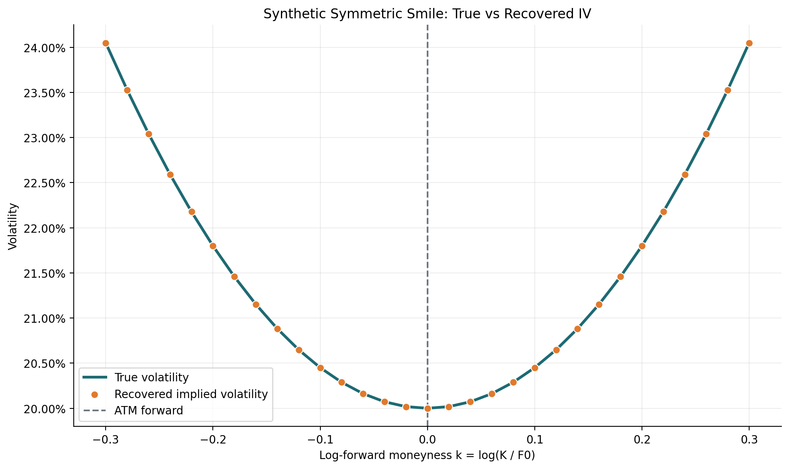
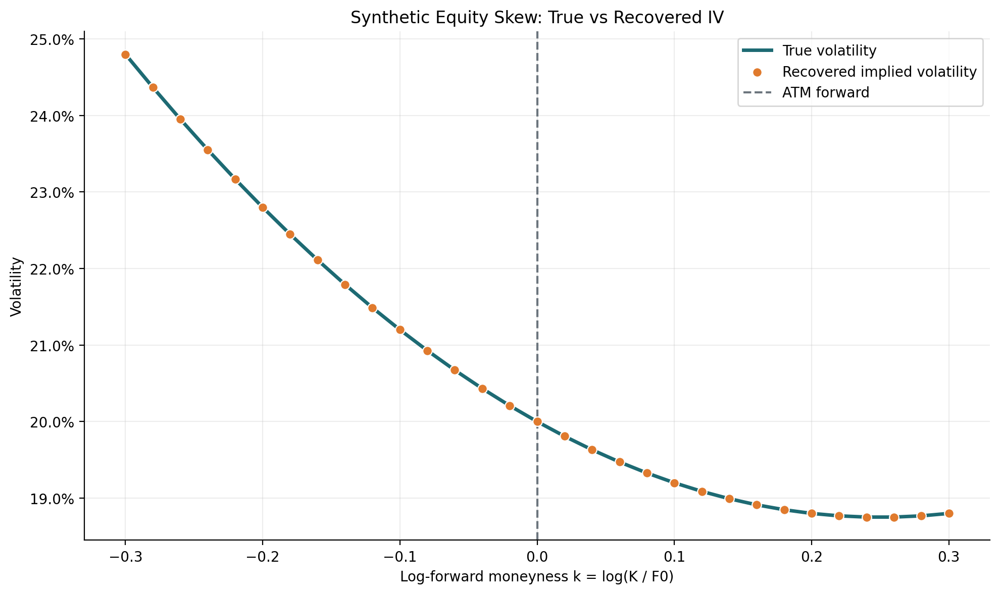
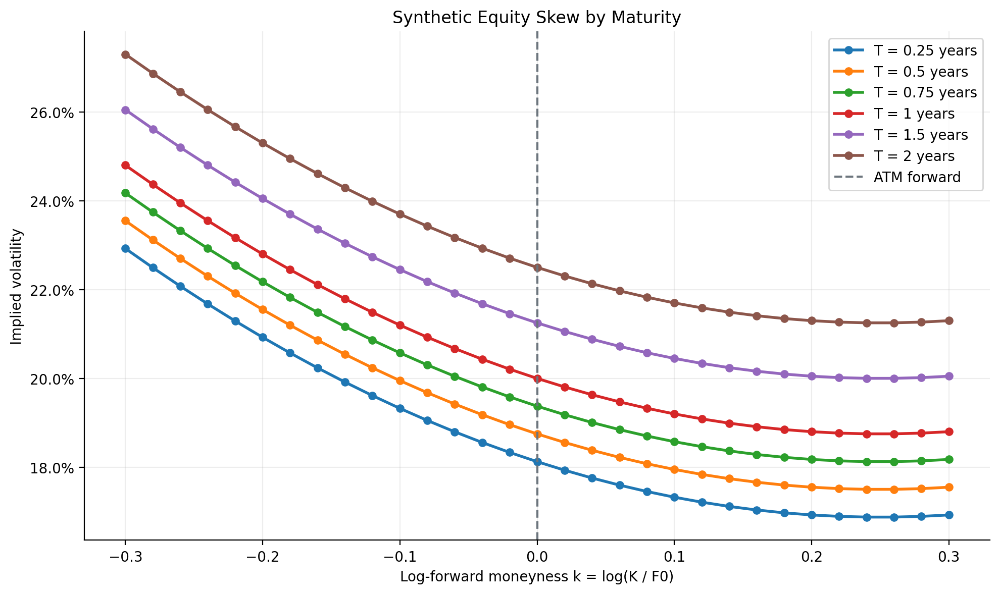
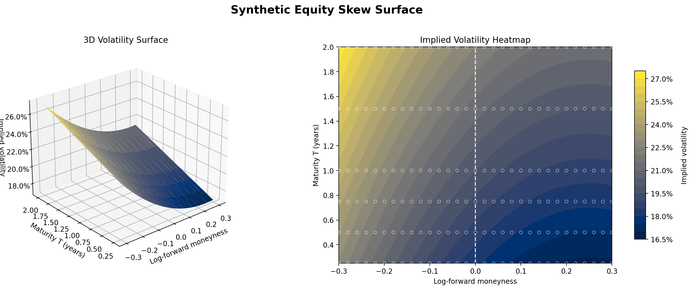

# Implied Volatility, Smiles and Surfaces

## Status

Status: **validated synthetic implementation; market-data application pending**.

The Black-Scholes-Merton pricing and Greeks modules provide the foundation for
this implementation. The current checkpoint recovers implied volatility from
an option price, organises the results into synthetic smiles and surfaces, and
generates the corresponding figures. The next checkpoint will apply the same
workflow to one frozen market snapshot.

This is not a research paper or a production calibration specification. Its
purpose is to make every implementation decision understandable and
inspectable. Each section connects to one function, test, experiment or
figure.

## Question and workflow

An option market gives us a premium, not the volatility used to produce that
premium. The first question is therefore:

> Which Black-Scholes-Merton volatility reproduces an observed European option
> price?

Once this inverse problem works for one option, the same calculation can be
repeated across strikes and maturities:

```text
one option price -> one implied volatility
many strikes     -> one volatility smile
many maturities  -> one volatility surface
```

The complete Quant Lab workflow will be developed in two stages:

```text
known synthetic volatility
        |
        v
BSM price -> IV solver -> recovered volatility -> smile and surface

frozen option-chain snapshot
        |
        v
quote cleaning -> selected premium -> IV solver -> Greeks
        |
        v
market smiles -> market surface -> IV versus realised volatility
```

Synthetic data checks numerical correctness because the true volatility is
known. Market data checks whether the workflow remains useful with bid-ask
spreads, missing contracts and imperfect quotes. These are different forms of
validation and neither replaces the other.

## Current checkpoint

As of 2 September 2026:

- bisection and guarded Newton-Raphson are implemented for European calls and
  puts, including dividends, price bounds and explicit convergence failures;
- 21 solver tests cover recovery, invalid inputs, bracket handling, low Vega
  and non-convergence;
- 12 additional tests validate log-forward moneyness and synthetic smile,
  skew and surface recovery;
- one command reproduces four synthetic figures;
- the complete repository test suite passes 101 tests.

The option-chain snapshot, quote cleaning and market surface are not yet
implemented. Every figure currently shown in this report is synthetic.

## Files and responsibilities

```text
src/derivatives/
    implied_vol.py
    vol_smile.py
    vol_surface.py
    volatility_plots.py

tests/
    test_implied_vol.py
    test_vol_smile.py
    test_vol_surface.py

scripts/
    generate_volatility_figures.py

reports/pricing/
    implied_vol_smile_surface.md
    figures/volatility/synthetic/
```

- `implied_vol.py` solves one inverse BSM pricing problem.
- `vol_smile.py` handles several strikes for one maturity.
- `vol_surface.py` combines several maturity slices.
- `volatility_plots.py` only draws values already calculated elsewhere.
- `generate_volatility_figures.py` reproduces the public experiments and
  figures from one command.
- The tests validate the mathematics independently of the plots.

The pricing modules must remain independent from the market-data provider.
The loader prepares clean numerical inputs; the solver does not download data.

## Inputs and conventions

| Symbol | Meaning | Convention |
| --- | --- | --- |
| $S$ | Current underlying spot | Strictly positive |
| $K$ | Strike | Strictly positive |
| $T$ | Remaining maturity | Years, strictly positive for inversion |
| $r$ | Risk-free rate | Annual continuously compounded decimal |
| $q$ | Continuous dividend yield | Annual continuously compounded decimal |
| $V_{\mathrm{obs}}$ | Observed option premium | Same currency unit as $S$ and $K$ |
| $\sigma$ | BSM volatility | Annualised decimal, so `0.20` means 20% |
| $\mathcal{V}$ | BSM Vega | Price sensitivity to a volatility change of `1.00` |

The existing BSM functions price European calls and puts. The first inverse
solver must therefore use the same rate, dividend, maturity and annualisation
conventions as those functions.

## 1. The inverse pricing problem

For fixed $S$, $K$, $T$, $r$ and $q$, define

$$
f(\sigma)
=V_{\mathrm{BSM}}(\sigma)-V_{\mathrm{obs}}.
$$

The implied volatility is the root

$$
f(\sigma_{\mathrm{imp}})=0.
$$

There is no convenient closed-form inverse of the normal-distribution terms in
the BSM formula, so the root must be found numerically.

For a regular European call or put,

$$
\frac{\partial V_{\mathrm{BSM}}}{\partial \sigma}
=\mathcal{V}>0.
$$

The price is therefore increasing with volatility. This monotonicity gives the
solver its structure:

- if the model price is below the observed price, volatility is too low;
- if the model price is above the observed price, volatility is too high;
- a valid premium has at most one implied volatility inside the search range.

Implied volatility is model-dependent. It is not a direct observation of
future realised volatility and it does not prove that the BSM assumptions are
true. It is a common scale used to compare option premiums.

## 2. Price bounds before iteration

A solver should reject an impossible premium before starting any numerical
iteration.

For a European call:

$$
\max\left(Se^{-qT}-Ke^{-rT},0\right)
\leq C
\leq Se^{-qT}.
$$

For a European put:

$$
\max\left(Ke^{-rT}-Se^{-qT},0\right)
\leq P
\leq Ke^{-rT}.
$$

The lower bound is the zero-volatility value. A premium equal to this bound,
within numerical tolerance, may therefore return an implied volatility of
zero. The upper bound is only approached as volatility tends to infinity, so
an exact upper-bound premium has no finite implied volatility.

The initial implementation policy is:

- reject non-positive spot, strike or maturity;
- reject an option type other than `call` or `put`;
- reject a premium below the lower bound or at or above the upper bound;
- return zero when the premium matches the lower bound within tolerance;
- fail explicitly when the selected volatility interval does not bracket a
  root.

Explicit failure is preferable to returning an unexplained value. It also
makes bad market quotes visible during the later cleaning stage.

## 3. Algorithm 1: bisection

### Intuition

Bisection starts with a low and a high volatility that surround the root. It
prices the option at the midpoint, discards the half that cannot contain the
solution and repeats.

The main variables are:

| Variable | Role |
| --- | --- |
| `observed_price` | Target market or synthetic premium |
| `sigma_low` | Lowest volatility still allowed by the current bracket |
| `sigma_high` | Highest volatility still allowed by the current bracket |
| `sigma_mid` | Midpoint tested during the current iteration |
| `model_price` | BSM price calculated at `sigma_mid` |
| `price_residual` | `model_price - observed_price` |
| `iteration` | Number of interval reductions already performed |

### One iteration

1. Compute the midpoint:

$$
\sigma_{\mathrm{mid}}
=\frac{\sigma_{\mathrm{low}}+\sigma_{\mathrm{high}}}{2}.
$$

2. Price the selected call or put at $\sigma_{\mathrm{mid}}$.
3. Compute the pricing residual.
4. If the residual is sufficiently small, return the midpoint.
5. If the model price is too high, replace the upper bound with the midpoint.
6. If the model price is too low, replace the lower bound with the midpoint.
7. Repeat until convergence or until the iteration limit is reached.

The direction in steps 5 and 6 follows directly from positive Vega: increasing
volatility increases the BSM price.

### Pseudocode

```text
validate inputs and the observed premium
evaluate the pricing error at both volatility bounds
verify that the bounds surround a root

repeat up to max_iterations:
    midpoint = average of low and high volatility
    residual = BSM price at midpoint - observed price

    if pricing residual is small enough:
        return midpoint

    if volatility interval is small enough:
        return midpoint

    if residual is positive:
        high = midpoint
    else:
        low = midpoint

raise an explicit convergence error
```

### Small interval example

Suppose the unknown volatility is `0.20` and the initial interval is
`[0.00, 1.00]`.

| Midpoint | Model price relative to target | New interval |
| ---: | --- | --- |
| `0.50` | Too high | `[0.00, 0.50]` |
| `0.25` | Too high | `[0.00, 0.25]` |
| `0.125` | Too low | `[0.125, 0.25]` |
| `0.1875` | Too low | `[0.1875, 0.25]` |
| `0.21875` | Too high | `[0.1875, 0.21875]` |

The root remains inside every retained interval. Bisection is therefore slow
but difficult to destabilise when the initial bracket is valid.

### Stopping criteria

Two errors answer different questions:

$$
\left|V_{\mathrm{BSM}}(\sigma_n)-V_{\mathrm{obs}}\right|
$$

measures the remaining pricing error, while

$$
\sigma_{\mathrm{high}}-\sigma_{\mathrm{low}}
$$

measures uncertainty about volatility. Both tolerances and the maximum number
of iterations must be explicit.

## 4. Algorithm 2: guarded Newton-Raphson

### Intuition

Newton-Raphson uses the slope of the pricing function instead of halving the
interval blindly. For BSM, this slope is Vega:

$$
\sigma_{n+1}
=\sigma_n
-\frac{V_{\mathrm{BSM}}(\sigma_n)-V_{\mathrm{obs}}}
{\mathcal{V}(\sigma_n)}.
$$

The fraction estimates the volatility correction required to remove the
current pricing error. Close to the root, Newton usually converges much faster
than bisection.

### Why it needs protection

Newton can become unreliable when:

- Vega is very small;
- the initial volatility is poor;
- the update becomes negative;
- the update leaves the valid volatility bracket;
- the quote has no valid finite root.

The Quant Lab version will therefore be guarded. It maintains a valid bracket
like bisection and accepts a Newton update only when that update is finite,
inside the bracket and based on a sufficiently large Vega. Otherwise it uses
the bracket midpoint for that iteration.

### Pseudocode

```text
validate the same inputs and bracket as bisection
choose an initial volatility inside the bracket

repeat up to max_iterations:
    residual = BSM price - observed price
    if residual is small enough:
        return current volatility

    update the bracket using the sign of the residual
    compute Vega at the current volatility

    if Vega is usable:
        candidate = current volatility - residual / Vega
    else:
        candidate = bracket midpoint

    if the candidate is outside the bracket or non-finite:
        candidate = bracket midpoint

    current volatility = candidate

raise an explicit convergence error
```

Guarded Newton is not a third unrelated model. It combines Newton's local
speed with the safety of a bisection bracket.

### Comparison

| Property | Bisection | Guarded Newton |
| --- | --- | --- |
| Required information | Valid bracket | Valid bracket and Vega |
| Convergence | Predictable but linear | Usually much faster near the root |
| Low-Vega behaviour | Stable but may need many iterations | Falls back to the midpoint |
| Main use | Reference implementation | Faster practical solver |
| Main risk | Bad initial bracket | Unsafe Newton update without guards |

Both methods should recover the same implied volatility on regular synthetic
cases. Their convergence histories will also be compared visually.

## 5. Synthetic validation

The core validation is a round trip:

```text
choose sigma_true
        |
        v
generate a BSM premium
        |
        v
forget sigma_true and invert the premium
        |
        v
compare recovered_sigma with sigma_true
```

This avoids relying on a vendor IV whose conventions may differ. The tests
cover:

1. one reference call;
2. one reference put;
3. calls and puts with a non-zero dividend yield;
4. several strikes, maturities and true volatilities;
5. equality with the zero-volatility lower bound;
6. premiums outside the valid price bounds;
7. a root outside the selected volatility bracket;
8. explicit non-convergence;
9. agreement between bisection and guarded Newton;
10. a low-Vega case in which the Newton guard is used.

The current plots validate the recovered smile and surface visually. The
automated round-trip tests, rather than the apparent smoothness of a curve,
provide the numerical evidence.

## 6. From one IV to a volatility smile

A smile holds maturity fixed and compares implied volatility across strikes.
Strike alone is not a stable comparison when rates, dividends or maturity
change, so the first convention will be log-forward moneyness:

$$
F_0=Se^{(r-q)T},
\qquad
k=\log\left(\frac{K}{F_0}\right).
$$

- $k=0$ is at-the-money forward.
- $k<0$ means the strike is below the forward.
- $k>0$ means the strike is above the forward.

Three transparent synthetic experiments are used:

### Flat volatility

Every strike is priced with the same known volatility. Inverting the generated
premiums must recover a horizontal line. This is the simplest end-to-end test
of strike ordering and solver consistency.

### Smile

A toy symmetric shape can be defined by

$$
\sigma_{\mathrm{true}}(k)
=\sigma_0+a k^2,
\qquad a>0.
$$

The objective is not to calibrate a market model. It is to generate known
prices and verify that inversion recovers the same curvature.

### Equity-style skew

A simple downward slope can be defined by

$$
\sigma_{\mathrm{true}}(k)
=\sigma_0+b k,
\qquad b<0,
$$

over a limited moneyness range that keeps volatility positive. This gives a
controlled example of higher downside implied volatility.

For each experiment, strike, moneyness, true volatility, generated premium and
recovered volatility must remain aligned in the same order.

## 7. From smiles to a volatility surface

Repeating the smile calculation across maturities produces

$$
\sigma_{\mathrm{imp}}
=\sigma_{\mathrm{imp}}(k,T).
$$

The synthetic surface uses an explicit positive function of moneyness and
maturity, for example:

$$
\sigma_{\mathrm{true}}(k,T)
=\sigma_0+b k+a k^2+c(T-T_0).
$$

Every grid point follows the same workflow:

1. compute its strike or moneyness and maturity;
2. evaluate the known synthetic volatility;
3. generate a BSM premium;
4. recover implied volatility with the solver;
5. compare the recovered value with the known input.

The first version does not need a sophisticated interpolation model. A
rectangular synthetic grid can be plotted directly. Interpolation will only be
introduced later if the irregular market grid requires it, and it must never
be presented as proof that the surface is arbitrage-free.

The current surface outputs are:

- a 3D surface with moneyness, maturity and implied volatility axes;
- a 2D heatmap or contour plot using the same volatility colour scale;
- smile slices that make individual maturities easier to read.

The colour gradient encodes implied volatility. Moneyness already has its own
axis and should not be encoded twice.

## 8. Market-data pipeline

Only after synthetic recovery works will the same solver be applied to one
frozen option-chain snapshot.

### Raw snapshot

The saved raw table should preserve at least:

- source and UTC collection time;
- underlying symbol and spot;
- expiration, option type, strike and contract identifier;
- bid, ask, last price and last-trade time;
- volume, open interest and vendor-provided IV when available.

The raw snapshot must remain unchanged after collection. Cleaning creates a
separate processed table so that every rejection can be audited.

### Cleaning sequence

1. remove rows with missing contract identity or invalid maturity;
2. reject non-finite, negative or crossed bid-ask quotes;
3. calculate the midpoint only for usable two-sided quotes;
4. calculate and retain the relative spread;
5. apply one documented liquidity or spread rule;
6. calculate $T$, $r$, $q$, the forward and moneyness;
7. reject premiums outside the appropriate price bounds;
8. calculate Quant Lab IV and its pricing residual;
9. calculate Delta, Gamma, Vega, Theta and Rho at that IV;
10. preserve a quality flag and rejection reason for every material filter.

The vendor IV is a diagnostic, not the project result. Differences may come
from quote selection, rates, dividends, exercise style, timing or vendor
conventions.

### First underlying

A European-style index option chain is the cleanest first application of the
BSM inverse problem. SPX is therefore preferable when a usable snapshot is
available. SPY can later connect this block to the existing historical-data
work and the American CRR module, but direct BSM inversion of SPY must be
labelled as a European approximation.

### Implied versus realised volatility

The market experiment will compare one documented ATM-forward implied
volatility with a realised-volatility estimate based on historical log returns:

$$
r_t=\log\left(\frac{S_t}{S_{t-1}}\right),
$$

$$
\sigma_{\mathrm{realised}}
=\operatorname{std}(r_t)\sqrt{N},
$$

where $N$ is the stated annualisation factor. Realised volatility is backward
looking, whereas implied volatility transforms a current option premium. A
difference between them is descriptive, not by itself a trading signal.

## 9. Reproducible figures

The current public figures are regenerated from the repository root with:

```bash
python3 -m scripts.generate_volatility_figures
```

All four experiments use $S=100$, $r=q=3\%$, an ATM volatility of $20\%$ and
log-forward moneyness from $-0.30$ to $0.30$. Setting $r=q$ makes the forward
equal to spot, so the generated strike grid matches the moneyness grid
directly.

The symmetric experiment isolates curvature around ATM-forward moneyness. The
line is the volatility used to create each BSM premium; the points are the IVs
recovered independently by the solver. It fixes $T=1$, uses zero slope and a
curvature coefficient of $0.45$.



The equity-style experiment combines a negative slope with positive curvature.
Its purpose is to verify that inversion preserves a controlled skew, not to
claim that these parameters were calibrated to a market. It fixes $T=1$ and
uses slope $-0.10$ and curvature $0.20$.



Repeating the skew across maturities exposes the term structure directly. The
slice plot remains easier to read precisely than the 3D view. The maturities
are $0.25$, $0.50$, $0.75$, $1.00$, $1.50$ and $2.00$ years, with an ATM
volatility slope of $0.025$ per year around the one-year reference maturity.



The final figure presents the same values as a 3D surface and a top-down
heatmap. The shared colour scale encodes IV; the circles are the calculated
grid points, and the dashed line marks ATM-forward moneyness.



The market-data checkpoint will add cleaned market slices, a market surface
and an ATM-forward implied-versus-realised volatility comparison. Those
outputs are deliberately absent until their inputs and filters are preserved
and documented.

The generator and surrounding text state which inputs vary, which remain fixed
and whether the data is synthetic or observed. A smooth plot is a visual aid,
not evidence of numerical correctness or absence of arbitrage.

## 10. Tests and definition of done

The synthetic checkpoint is complete because:

- bisection and guarded Newton recover known call and put volatilities;
- invalid premiums and invalid brackets fail explicitly;
- convergence tolerances and iteration limits are tested;
- a flat synthetic slice is recovered quantitatively;
- known smile, skew and surface functions are recovered within tolerance;
- strikes, maturities, prices and IV values remain aligned;
- every synthetic premium is reproduced by the recovered IV within solver
  tolerance;
- all figures are generated by one explicit command.

The full market-data block will be complete when:

- one raw market snapshot and its processed version are preserved;
- quote filters and retained-contract counts are documented;
- every retained premium is reproduced within solver tolerance;
- market IV and Greeks are calculated by Quant Lab rather than copied;
- the smile, surface and IV-versus-realised-volatility figures are generated
  reproducibly from one script;
- the report explains numerical results, data limitations and model mismatch.

## Limits and later extensions

- BSM implied volatility depends on the selected premium and model inputs.
- Bid, ask and midpoint generally imply different volatilities.
- Near-expiry and deep ITM or OTM options may have very low Vega.
- Synthetic recovery validates implementation, not market realism.
- A frozen snapshot does not describe surface dynamics through time.
- Free market data may be delayed, incomplete or temporarily unavailable.
- Applying European BSM inversion to American options introduces model error.
- Smooth interpolation can hide bad quotes or introduce inconsistencies.
- A complete arbitrage-free calibration is outside this first block.

Possible later extensions include Brent's method, repeated point-in-time
snapshot collection, an explicit rate curve, dividend or forward inference,
arbitrage-aware interpolation and specialised parameterisations such as SVI or
SABR. They are not required to understand or complete the current workflow.

## Implementation order

1. [x] Finalise the solver API and price-bound policy.
2. [x] Implement bisection and validate synthetic round trips.
3. [x] Test puts, dividends, brackets and failure cases.
4. [x] Implement guarded Newton with the existing Vega.
5. [x] Verify agreement between both solvers.
6. [x] Recover flat, smile and skew synthetic slices.
7. [x] Recover and plot a known synthetic surface.
8. [ ] Freeze one market snapshot and define its processed schema.
9. [ ] Clean quotes and calculate Quant Lab IV and Greeks.
10. [ ] Generate the market smile, surface and realised-volatility comparison.
11. [ ] Connect the market stages through one reproducible script.
12. [ ] Review the complete market report before the final block release.

## References

- John C. Hull, *Options, Futures, and Other Derivatives*, chapters 15 and 20.
- Steven E. Shreve, *Stochastic Calculus for Finance I*, for discrete-time
  no-arbitrage and risk-neutral valuation foundations.
- Existing Quant Lab reports on
  [vanilla pricing](vanilla_option_pricing.md),
  [Greeks](black_scholes_greeks.md) and
  [binomial pricing](binomial_option_pricing.md).
